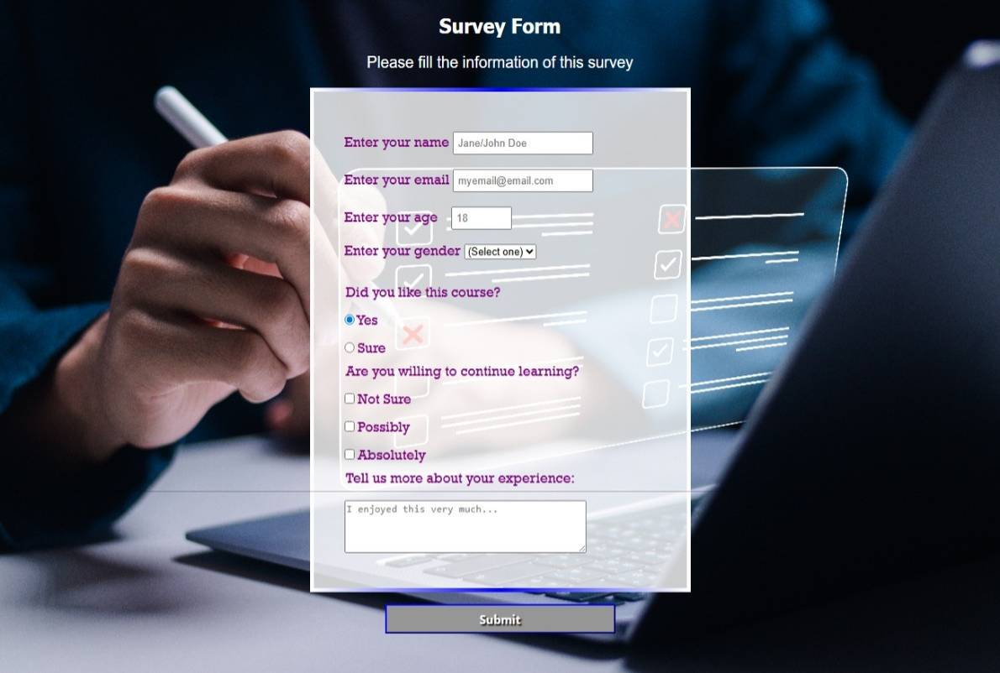

# Survey Form

A responsive survey form built with HTML and CSS as part of the **Responsive Web Design Certification** from [freeCodeCamp](https://www.freecodecamp.org/).

## 📋 Live Demo

[View the live form here](https://jesusesp85.github.io/survey-form/)  

## 🛠️ Technologies Used

- HTML5
- CSS3

## 📌 Project Description

This project is a clean and accessible survey form that collects user input through various types of form elements. It includes:

- Text inputs, radio buttons, checkboxes, and dropdowns
- Semantic HTML structure
- Responsive design for mobile and desktop
- Basic form validation

## 📁 Project Structure

## 📸 Screenshot

  

## 🧠 What I Learned

- Creating accessible and semantic forms
- Styling form elements with CSS
- Structuring responsive layouts

## 📬 Contact

Created by [@Jesusesp85](https://github.com/Jesusesp85)  
Feel free to reach out with feedback or suggestions!

---
